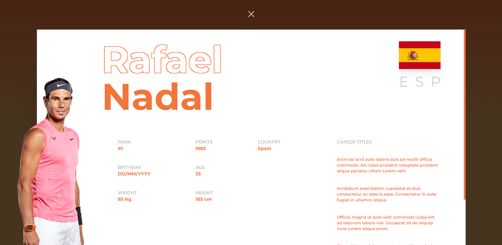

# Tennis Webapp

Tennis is a technical challenge: given a sketch and some seeds, i had to implement a website which provides informations about tennis players.

It is a dockerized webapp, which includes a React App, and an Express API, along with a Postgresql database.

The tennis webapp provides users with access to information about tennis players, including their ranking, points, weight, country of origin, age, and other relevant details.


More details about a specific player can be shown by clicking on it:



The frontend uses the following stack:
  - Typescript
  - React
  - Tailwind

The backend uses the following stack:
  - Typescript
  - Express
  - Postgresql
  - Prisma

## Installation

As it is a dockerized app, it is pretty easy to run the app with only one command:

```
DB_NAME=postgres DB_PASSWORD=password npm run up
```

Once this command is run the website is accessible at this url: [http://localhost:5001/](http://localhost:5001/)

`DB_NAME` and `DB_PASSWORD` are two mandatory environment variables required for the application to work:
  - `DB_NAME`: The postgres user and database name.
  - `DB_PASSWORD`: The postgres user's password.

There are two other optional environment variables:
  - `FRONT_PORT`: The port in wich the frontend is mapped to (5001 by default).
  - `BACK_PORT`: The port in which the backend is mapped to (5000 by default).
  - `API_URL`: The api url. Once deployed, this should be the public domain or IP address (localhost:5000 by default).

The app can be stopped with the following command:

```
npm run down
```

You may use a `.env` file in order to store the environment variables:

```
DB_NAME=postgres
DB_PASSWORD=password
API_URL=example.com
```

Then you can use `dotenv` to load the environment variables:

```
dotenv -e .env -- npm run up
```

But you dont have to use `dotenv` actually, you can use this command:

```
env $(cat .env | grep '#') npm run up
```
